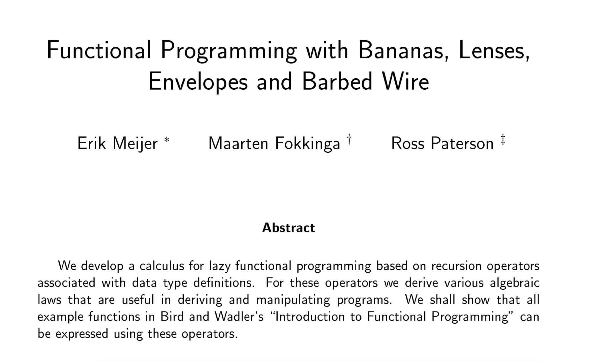
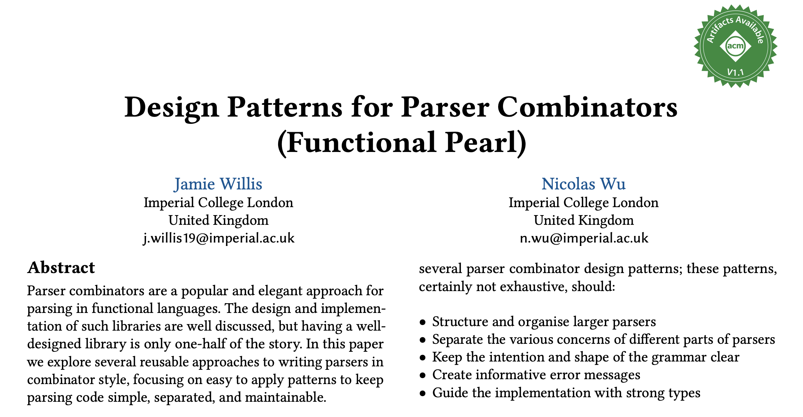
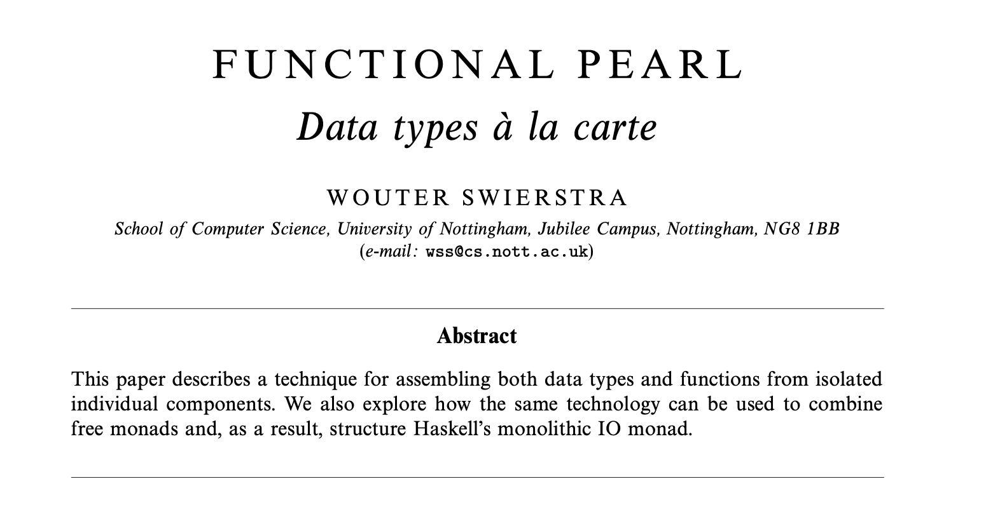

# Lean 函数式程序设计

## 动机

- 许多策略会被翻译成函数式程序设计的常见组分，学习函数式程序设计对读懂这些策略具体如何工作有帮助

```Lean4
def id {A : Type _} (x : A) : A := x

def id : {A : Type _} -> (x : A) -> A := fun x => x

def id {A : Type _} (x : A) : A := by
  exact x

def id : {A : Type _} -> (x : A) -> A := by
  intro _ x
  exact x
```

- 归纳地定义数据类型、递归地在数据类型上定义函数的能力，是程序设计和逻辑推理的自然基础；有良好的函数式定义组织能力在对定义的结构做归纳时会更简单

```Lean4
import Mathlib.Init.Logic

inductive ℕ where
  | zero : ℕ
  | succ : ℕ -> ℕ

def add : ℕ -> ℕ -> ℕ
  | .zero  , n => n
  | .succ m, n => .succ $ add m n

def add_identity (n : ℕ) : n = add n .zero :=
  match n with
  | .zero   => rfl
  | .succ n => congr_arg ℕ.succ $ add_identity n

def add_succ (m n : ℕ) : .succ (add m n) = add m (.succ n) :=
  match m with
  | .zero   => rfl
  | .succ m => congr_arg ℕ.succ $ add_succ m n

def add_comm (m n : ℕ) : add m n = add n m :=
  match m with
  | .zero   => add_identity n
  | .succ m => Eq.trans
      (congr_arg ℕ.succ $ add_comm m n)
      (add_succ n m)
```

- 在 Lean 中编写 tactics 的语法和语义定义都依赖于良好的函数式程序设计基础，特别是要有能处理 monadic 代码的能力

`CoreM`、`MetaM`、`TermElabM`、`TacticM`

- 函数式程序设计本身很有趣，Lean 也对函数式程序设计有一定支持

```Lean4
@[default_target]
lean_exe «hello» {
  root := `Main
}
```


- 有的证明过程本质上和函数式程序设计是相同的

[*Programming Language Foundations in Agda* Properties: Progress and Preservation](https://plfa.github.io/Properties/) deriving an evaluator from a proof of progress

- Lean 缺少很多 functional pearl 定位的库







## 列表

- 归纳定义的列表

```Lean4
inductive List (A : Type _) where
  | nil  : List A
  | cons : A -> List A -> List A
```

- 在列表上递归定义函数

```Lean4
def map {A B : Type _} : (A -> B) -> (List A -> List B) :=
  fun f xs =>
    match xs with
    | []      => []
    | x :: xs => f x :: map f xs

def filter {A : Type _} (f : A -> Bool) : List A -> List A
  | []      => []
  | x :: xs => if f x
      then x :: filter f xs
      else      filter f xs
```

- recursive schemes

```Lean4
def foldl {A B : Type _} : (B -> A -> B) -> B -> List A -> B :=
  fun f acc xs =>
    match xs with
    | []      => acc
    | x :: xs => foldl f (f acc x) xs
```

[Every `foldl` is a `foldr`.](https://stackoverflow.com/a/26036320)

- list comprehension

```
[ x ] = pure x
[ f x | x <- xs ] = map (fun x => f x) xs
[ f x y | x <- xs, y <- ys ] = join [ [f x y | y <- ys ] | x <- xs ]
[ c | p ] = if p then [c] else []
```

```
pure x = [ x ]
map f xs = [ f x | x <- xs ]
join xss = [ x | xs <- xss, x <- xs ]
```

## `Option`

- 归纳定义的 `Option`
- 在 `Option` 上递归定义函数
- callback hell

## Monads

- do
- comprehension

```
xs >>= k = join (k <$> xs)
join xss = xss >>= id
```

## [IO](https://leanprover-community.github.io/mathlib4_docs/Init/System/IO.html)

- main

## Monad Transformers

- State

```Lean4
inductive State (S : Type _) : Type _ -> Type _ where
  | get : State S S
  | put : S -> State S Unit
  | pure : {A : Type _} -> A -> State S A
  | bind : {A : Type _} -> {B : Type _}
        -> State S A
        -> (A -> State S B)
        -> State S B

instance {S : Type _} : Monad (State S) where
  pure := State.pure
  bind := State.bind

def runState {S A : Type _} : S -> State S A -> A × S :=
  fun init xs =>
    match xs with
    | .get => (init, init)
    | .put st => ((), st)
    | .pure x => (x, init)
    | .bind xs k =>
        let ⟨x, st⟩ := runState init xs
        runState st (k x)
```

- Identity
- StateT

## Intuitionistic Logic

## Further Reading

- more about monads
  + [Comprehending monads](https://homepages.inf.ed.ac.uk/wadler/papers/monads/monads.dvi)
  + [Data types à la carte](https://www.cambridge.org/core/journals/journal-of-functional-programming/article/data-types-a-la-carte/14416CB20C4637164EA9F77097909409)
  + [Lean 4 list comprehension](https://github.com/leanprover/lean4-samples/tree/main/ListComprehension)
- more about recursive schemes
  + [Functional Programming with Bananas, Lenses, Envelopes and Barbed Wire](https://maartenfokkinga.github.io/utwente/mmf91m.pdf)
- lenses and other optics
  + [Lenses tutorial](https://www.fpcomplete.com/haskell/tutorial/lens/)
  + [Optics](https://hackage.haskell.org/package/optics/docs/Optics.html)
